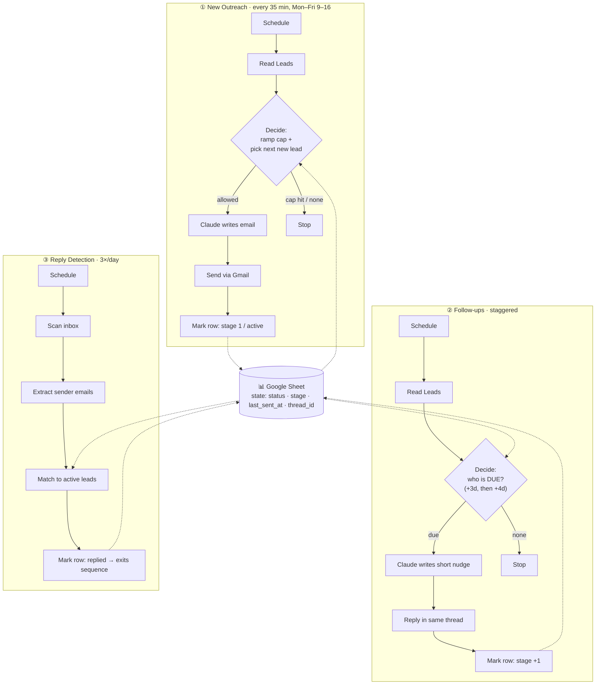

<div align="center">

# 🚀 AI Cold Outreach Engine

### A self-warming cold-email system that personalizes every message with AI, sequences follow-ups, detects replies, and protects your domain from being burned.

Built on **n8n** + **Claude** + **Gmail / Google Workspace** + **Google Sheets**.

[](https://n8n.io)
[-D97757)](https://www.anthropic.com)
[](https://developers.google.com/gmail)
[](LICENSE)
[](docs/SETUP.md)

</div>

---

## 💡 The Problem

Most cold-email automations get you blacklisted in a week. They blast hundreds of identical emails from a brand-new inbox on day one — so spam filters torch the sender's reputation, and the domain becomes unusable.

The hard part of cold outreach isn't *sending*. It's sending in a way that **keeps landing in the inbox next month.**

## ✅ The Solution

This engine is built around **deliverability as a first-class constraint.** It sends like a careful human, not a blasting robot:

- **Warms itself up** — starts at 5 emails/day and ramps to 15 over 4 weeks, automatically.
- **Personalizes every email with AI** — Claude writes a unique, 3–4 sentence message per lead from that company's real description. No `Dear [First Name]` giveaways.
- **Runs a 3-step follow-up sequence** — threaded as real replies, because ~80% of responses come from follow-ups.
- **Detects replies and backs off** — anyone who responds is automatically pulled out of the sequence.
- **Engineered to stay out of spam** — plain text, no links/images/tracking pixels, business-hours-only sending, randomized human-like timing, and full SPF/DKIM/DMARC guidance.

---

## 🏗️ Architecture

Three independent, scheduled flows share one Google Sheet as a lightweight state machine.



### The state machine
Each lead row moves through a simple, idempotent lifecycle — which is what makes the whole thing safe to run unattended:

| `status` | Meaning |
|---|---|
| *(blank)* / `pending` | New lead, never contacted |
| `active` | In the sequence (1–3 emails sent) |
| `replied` | Responded — automatically removed from follow-ups |
| `done` | Completed all 3 touches with no reply |

A **shared daily cap** is enforced across *all three flows* by counting `last_sent_at == today`, so follow-ups can never push total volume past the warm-up limit.

---

## 🧠 Engineering Highlights

> The parts worth reading the code for.

- **Warm-up ramp as a pure function of time.** Day count is derived from a persisted `startDate` in workflow static data; the daily cap is computed from it (`5 → 8 → 12 → 15`). No manual intervention, no cron-juggling.
- **Idempotent sends.** State lives in the sheet, not in memory. A lead is only ever picked if its `status` is open, so crashes, restarts, and overlapping runs can't double-send.
- **Reply detection without per-lead API hammering.** A single inbox sweep extracts sender addresses by regex and reconciles them against `active` leads in bulk — O(inbox) instead of O(leads) Gmail calls.
- **Threaded follow-ups.** The original Gmail `message_id` / `thread_id` are persisted on send, so follow-ups go out as genuine replies in the same conversation (better context, better deliverability).
- **Prompt engineering for trust, not hype.** The model is given a strict allow-list of true facts and is explicitly forbidden from inventing numbers, banned from em-dashes and spam-trigger phrasing, and capped at 3–4 sentences.
- **Deliverability hardening:** plain-text only, zero links/images/tracking, weekday business-hours window, and a randomized 30–90s human jitter between sends.

---

## 📈 What to Expect

With authentication set up correctly and the ramp respected:

- ✅ **Inbox placement** (9–10/10 on [mail-tester](https://www.mail-tester.com)) instead of the spam folder
- ✅ **~10–15 personalized conversations started per week** from a single inbox — safely
- ✅ A sending domain that's **still healthy in month 3**, not burned in week 1

*Cold email isn't about sending more. It's about sending slower and smarter so the channel still works next month.*

---

## ⚙️ Tech Stack

| Layer | Tool | Why |
|---|---|---|
| Orchestration | **n8n** | Visual, self-hostable, runs 24/7 in the cloud |
| AI copywriting | **Claude (Anthropic Messages API)** | Natural, non-spammy writing; strict instruction-following |
| Sending | **Gmail API / Google Workspace** | Trusted sender infrastructure |
| State / CRM | **Google Sheets** | Zero-infra, human-editable database |
| Deliverability | **SPF · DKIM · DMARC** | The actual reason mail lands in the inbox |

---

## 🚀 Quick Start

```bash
# 1. Import the workflow into n8n
#    workflow/cold-email-engine.n8n.json  →  n8n → Import from File

# 2. Connect 3 credentials: Gmail OAuth2, Google Sheets OAuth2,
#    and a Header Auth for Anthropic (name: x-api-key)

# 3. Create a Google Sheet (see docs/GOOGLE_SHEET.md) and paste its ID

# 4. Edit the 4 CONFIG lines in the "Build Initial Email" node

# 5. Set up SPF/DKIM/DMARC (docs/DELIVERABILITY.md) → test → go live
```

📖 **Full walkthrough:** [docs/SETUP.md](docs/SETUP.md)

---

## 📂 Repository Structure

```
ai-cold-outreach-engine/
├── workflow/
│   └── cold-email-engine.n8n.json   # The importable n8n workflow (34 nodes, 3 flows)
├── src/                             # Code-node logic, kept as clean JS files
│   ├── decideInitial.js             # Warm-up ramp + daily cap + lead selection
│   ├── decideFollowup.js            # Follow-up scheduling logic
│   ├── buildInitial.js              # First-touch prompt builder
│   ├── buildFollowup.js             # Follow-up prompt builder
│   ├── parseInitial.js              # Claude response parser
│   ├── parseFollowup.js
│   ├── extractSenders.js            # Reply-detection: inbox → sender emails
│   ├── matchRepliers.js             # Reply-detection: reconcile against leads
│   └── build.js                     # Assembles src/ → the workflow JSON
├── docs/
│   ├── SETUP.md                     # 15-minute setup guide
│   ├── GOOGLE_SHEET.md              # Lead-sheet schema
│   ├── DELIVERABILITY.md            # SPF/DKIM/DMARC + anti-spam playbook
│   └── ARCHITECTURE.md              # Design decisions & data flow
└── LICENSE
```

> **Note on the build step:** the Code-node JavaScript is authored as standalone files in `src/` and assembled into the workflow JSON by `build.js`. This keeps the logic readable, reviewable, and version-controlled — instead of buried inside an opaque exported JSON blob.

---

## 🗺️ Roadmap

- [ ] A/B subject-line testing with per-variant reply-rate tracking
- [ ] Bounce handling (auto-mark `bounced`, exclude from sequence)
- [ ] Slack/Telegram notification on every reply
- [ ] Lead enrichment step before the first touch
- [ ] Per-lead send-time optimization by timezone

---

## 📝 License

MIT — see [LICENSE](LICENSE). Use it, fork it, ship it.

<div align="center">

**Built by [Shafeel](https://github.com/shafeelahamed15)** · If this helped you, a ⭐ goes a long way.

</div>
