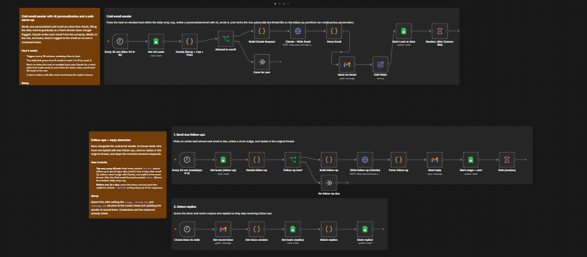
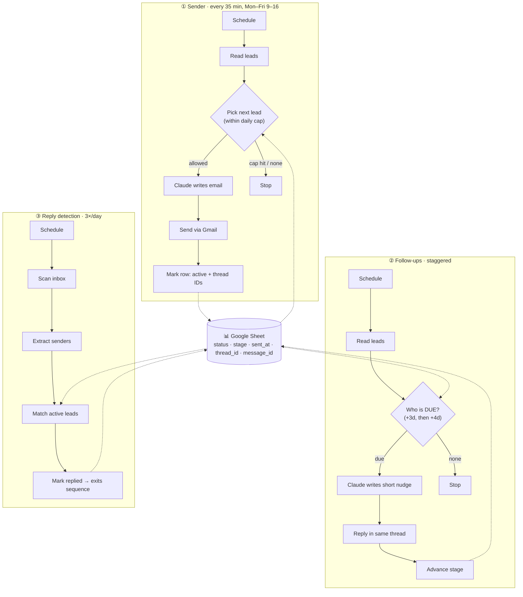

<div align="center">

# 🚀 AI Cold Outreach Engine

### A self-warming cold-email system that personalizes every email with AI, runs a follow-up sequence, detects replies, and protects your sending domain from being burned.

Built with **n8n** · **Claude** · **Gmail / Google Workspace** · **Google Sheets** — runs itself 24/7.

[](https://n8n.io)
[-D97757)](https://www.anthropic.com)
[](https://developers.google.com/gmail)
[](LICENSE)
[](#-contributing)

**If this saves you from burning an inbox, drop a ⭐ — it genuinely helps.**

</div>



---

## 💡 Why this exists

Most cold-email automations get you blacklisted in a week. They blast hundreds of identical emails from a brand-new inbox on day one, so spam filters torch the sender's reputation and the domain becomes unusable.

The hard part of cold outreach isn't *sending*. It's sending in a way that **keeps landing in the inbox next month.**

This engine treats **deliverability as the #1 constraint**. It sends like a careful human, not a blasting robot — and it's a complete, working system, not a toy demo.

## ✨ What it does

- 🔥 **Warms itself up** — starts at 5 emails/day and ramps to 15 over 4 weeks, automatically.
- 🧠 **Personalizes every email with AI** — Claude writes a unique 3–4 sentence email per lead from that company's real description. No `Dear [First Name]` giveaways.
- 🔁 **Runs a 3-step follow-up sequence** — email 2 after 3 days, email 3 after 4 more, each sent as a **reply in the same thread** (that's where ~80% of responses come from).
- 🛑 **Detects replies and backs off** — anyone who responds is automatically pulled out of the sequence.
- 📊 **Tracks everything in a Google Sheet** — a human-editable mini-CRM; nobody is ever emailed twice.
- 🛡️ **Engineered to stay out of spam** — plain text, no links/images/tracking pixels, business-hours-only sending, randomized human-like timing, full SPF/DKIM/DMARC guidance.

---

## 🏗️ How it works — three flows, one shared sheet



| | The sender | The follow-ups | Reply detection |
|---|---|---|---|
|  |  |  |

### The state machine
Each lead row moves through a simple, idempotent lifecycle — which is what makes it safe to run unattended:

| `status` | Meaning |
|---|---|
| *(blank)* / `pending` | New lead, never contacted |
| `active` | In the sequence (1–3 emails sent) |
| `replied` | Responded — automatically removed from follow-ups |
| `done` | Completed all 3 touches with no reply |

A **shared daily cap** is enforced across all three flows, so follow-ups can never push total volume past the warm-up limit.

---

## ⚙️ Tech stack

| Layer | Tool | Why |
|---|---|---|
| Orchestration | **n8n** | Visual, self-hostable, runs 24/7 in the cloud |
| AI copywriting | **Claude (Anthropic Messages API)** | Natural, non-spammy writing; strict instruction-following |
| Sending | **Gmail API / Google Workspace** | Trusted sender infrastructure |
| State / CRM | **Google Sheets** | Zero-infra, human-editable database |
| Deliverability | **SPF · DKIM · DMARC** | The actual reason mail lands in the inbox |

---

## 🚀 Quick start

```text
1. Import  workflow/cold-email-engine.n8n.json  into n8n
2. Connect 3 credentials: Gmail OAuth2, Google Sheets OAuth2,
   and a Header Auth for Anthropic (header name: x-api-key)
3. Create the Google Sheet (see docs/GOOGLE_SHEET.md) and paste its ID into the Sheets nodes
4. Edit the 4 CONFIG lines at the top of the "Build Initial Email" node (your name + offer)
5. Set up SPF/DKIM/DMARC (docs/DELIVERABILITY.md) → send yourself a test → go live
```

📖 **Full walkthrough:** **[docs/SETUP.md](docs/SETUP.md)** — a complete step-by-step with screenshots and the gotchas that trip people up.

> Just want the basics? `workflow/cold-email-sender.n8n.json` is a **single-flow "lite" version** (sender only, no follow-ups) — perfect for a first run.

---

## 🧠 Engineering highlights

> The parts worth reading the code for.

- **Warm-up ramp as a pure function of time.** Day count comes from a persisted `startDate`; the daily cap is derived from it (`5 → 8 → 12 → 15`). No manual intervention.
- **Idempotent sends.** State lives in the sheet, not in memory. A lead is only picked if its `status` is open, so crashes, restarts, and overlapping runs can't double-send.
- **Reply detection without per-lead API hammering.** A single inbox sweep extracts sender addresses with one regex pass and reconciles them against the lead list in bulk — `O(inbox)` instead of `O(leads)` Gmail calls.
- **Threaded follow-ups.** The original Gmail `message_id` / `thread_id` are persisted on send, so follow-ups go out as genuine replies in the same conversation.
- **Prompt engineering for trust, not hype.** The model gets a strict allow-list of true facts and is forbidden from inventing numbers, banned from em-dashes and spam-trigger phrasing, and capped at 3–4 sentences.
- **Readable, reviewable code.** The Code-node logic lives as plain `.js` files in `src/` and is assembled into the workflow JSON by `build.js` — diff-able and testable, instead of buried in an exported blob.

---

## 📂 Repository structure

```
ai-cold-outreach-engine/
├── workflow/
│   ├── cold-email-engine.n8n.json   # Full system: sender + follow-ups + reply detection
│   └── cold-email-sender.n8n.json   # Lite: sender only (great first run)
├── src/                             # Code-node logic as clean JS + build scripts
├── docs/
│   ├── SETUP.md                     # Step-by-step setup (start here)
│   ├── GOOGLE_SHEET.md              # Lead-sheet schema
│   ├── DELIVERABILITY.md            # SPF/DKIM/DMARC + anti-spam playbook
│   └── ARCHITECTURE.md              # Design decisions & data flow
├── assets/                          # Screenshots
└── LICENSE
```

---

## 🗺️ Roadmap

- [ ] A/B subject-line testing with per-variant reply-rate tracking
- [ ] Bounce handling (auto-mark `bounced`, exclude from sequence)
- [ ] Slack / Telegram notification on every reply
- [ ] Lead enrichment step before the first touch
- [ ] Per-lead send-time optimization by timezone

## 🤝 Contributing

Issues and PRs welcome. Good first contributions: new email templates, an Outlook/SMTP variant, or a bounce-handling flow. If you build something cool on top of this, open an issue — happy to link it.

## 📝 License

MIT — see [LICENSE](LICENSE). Use it, fork it, ship it.

<div align="center">

Built by **[Shafeel](https://github.com/shafeelahamed15)** · ⭐ the repo if it helped you avoid a burned inbox.

</div>
